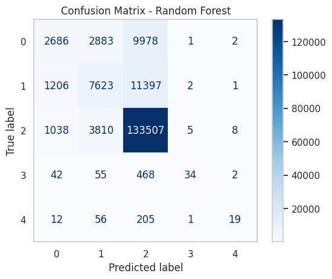
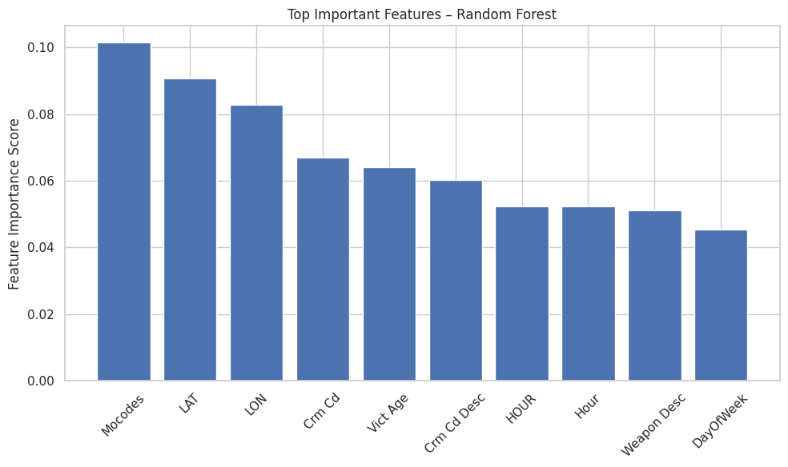
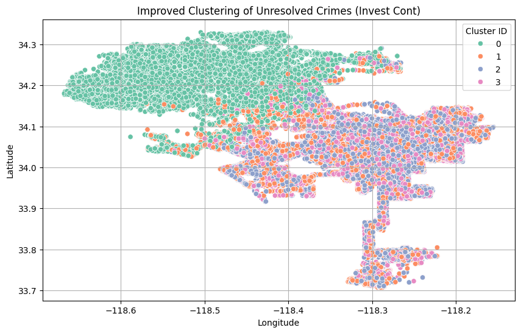

# Crime Resolution Prediction System

This project applies machine learning to predict whether a crime case will be resolved (solved) or remain unresolved, using historical crime records from the Los Angeles Police Department (LAPD).  
The system integrates supervised classification models with exploratory clustering techniques to provide predictive insights and identify hidden crime patterns.

---

## Project Overview
- Goal: Predict the resolution status of crime cases (solved vs. unsolved).  
- Dataset: 66,000+ crime reports (LAPD Open Data Portal, 2020–present).  
- Techniques Used:  
  - Data wrangling, feature engineering, and transformation  
  - Supervised models (Logistic Regression, Decision Tree, Random Forest)  
  - Evaluation with Accuracy, Precision, Recall, F1-score  
  - Clustering (KMeans) for hotspot and unresolved case analysis  

---

## Tech Stack
- Languages & Libraries: Python, Pandas, Scikit-learn, Matplotlib, Seaborn, GeoPandas, Folium  
- Environment: Jupyter Notebook / Google Colab  
- Dataset URL: https://catalog.data.gov/dataset/crime-data-from-2020-to-present

---

## Model Performance
| Model               | Accuracy | Precision | Recall | F1-score |
|----------------------|----------|-----------|--------|----------|
| Logistic Regression  | 78.6%    | 68.4%     | 78.6%  | 70.3%    |
| Decision Tree        | 74.3%    | 75.3%     | 74.3%  | 74.8%    |
| Random Forest        | 82.2%    | 79.1%     | 82.2%  | 79.3%    |

Random Forest was chosen as the final model for its balance between precision and recall, robustness against overfitting, and interpretability via feature importance.

---

## Sample Results

### Confusion Matrix (Random Forest)


### Feature Importance (Random Forest)


### KMeans Clustering of Unresolved Cases (Exploratory)


---

## Repository Structure
```
├── Crime_Resolution_Prediction_System.ipynb   # Full notebook (Google Colab/Jupyter)
├── Crime_Data_from_2020_to_Present.csv        # Raw dataset (if within size limit)
├── cleaned_crime_data.csv                     # Preprocessed dataset
├── docs/
│   ├── Project_Report_Final.pdf               # Final project report
│   ├── Colab_Work.pdf                         # Full notebook export (PDF)
├── images/
│   ├── confusion_matrix.png                   # Random Forest confusion matrix
│   ├── feature_importance.png                 # Random Forest feature importance
│   ├── crime_clusters.png                     # KMeans clustering visualization
└── README.md
```

---

## Reports
- [Final Project Report (PDF)](docs/Project_report_final.pdf)  
- [Colab Notebook Export (PDF)](docs/Colab_work.pdf)  

---

## Future Work
- Add NLP-based analysis on narrative crime descriptions  
- Explore advanced models (XGBoost, LightGBM) for improved accuracy  
- Integrate fairness & bias auditing for equitable predictions  
- Build an interactive dashboard for law enforcement agencies  

---

## Author
**Reema Mahabooba**  
